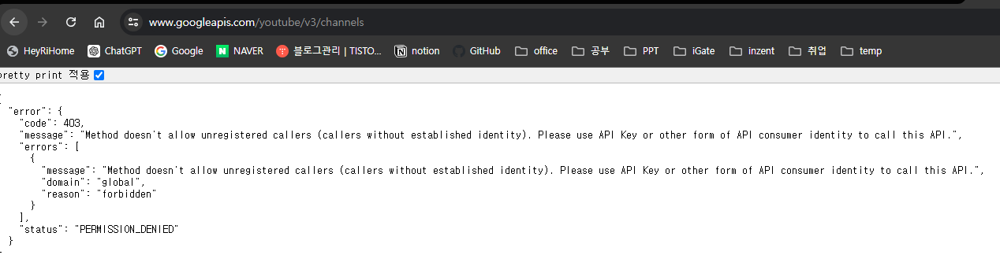

# OAuth 2.0 이해하기

## OAuth란?

만약 나의 서비스에서 타 서비스(Google, Facebook, Kakao 등)와 연동해서 무언가를 하고 싶을 때 어떻게 할 수 있을까?

* 이해를 돕기 위해 타 서비스를 Google이라고 예시를 들어 설명합니다.

### **1. Google의 ID/PASSWORD를 통해 연동한다면 ?**

1. **사용자 입장**

   : 자신의 Google 계정 정보를 타 사이트가 알게 되는 것은 위험하다고 느껴진다.

2. **나의 서비스**

   : Google 의 계정 정보를 나의 서비스가 알게 된다면, 해킹과 같은 보안 이슈가 발생했을 때 큰 피해를 입을 수 있음.

3. **Google**

   : 자신의 사용자 계정 정보를 타 서비스가 가지고 있는 건 당연히 허용할 수 없음


이러한 상황을 해결해 줄 수 있는 기술이 OAuth이다.

OAuth를 활용한다면 Google이 제공하는 서비스와 안전하게 연동할 수 있다.

### **2. OAuth를 통해 연동한다면 ?**

: 타 서비스가 발급하는 AccessToken을 통해 Google에 접근해서 필요한 기능을 수행하기 때문에 안전하다.

<aside>
💡 **AccessToken을 사용하면 발생하는 장점**

1. AccessToken을 사용하면 사용자의 계정 정보는 담겨있지 않다.

타 서비스와 사용하기로 약속된 기능에만 유효한 token 이다.

1. 타 서비스와 사용하기로 약속된 기능에만 유효한 token 이다.
</aside>

---

## OAuth 역할 및 용어

1. **Google** ⇒ **Resource Server** (리소스 제공자)
    1. Google에서 인증/인가 역할만 담당 ⇒ Authorization Server
2. **사용자** ⇒ **Resource Owner** (리소스 소유자)
3. **나의 서비스(서버)** ⇒ **Client** (리소스에 접근해서 사용)

<aside>
⚠️ 용어가 익숙하지 않은 사람의 이해를 위해 사용자, Google, 나의 서비스와 같은 단어를 사용합니다.
하지만, 공식 문서는 위의 용어를 사용하므로 숙지하길 바랍니다.

</aside>

## **OAuth 사용 흐름**

<aside>
💡 크게 보면 위와 같은 흐름으로 진행된다. 
1. 나의 서비스를 Google에 등록하기
2. 사용자의 승인 받기
3. Google의 AccessToken 받기
4. 해당 AccessToken을 통해 Google이 제공하는 API 호출
5. AccessToken이 만료되면 RefreshToken을 통해 다시 발급

</aside>

### **🔍 Client(나의 서비스) 등록**

1. **일단 먼저 Google에 나의 서비스를 등록해두어야 한다.**
    - 나의 서비스 등록 시 사용되는 정보

        <aside>
        ✅ Resource Server마다 다르지만, 아래는 공통적으로 필요한 값이다.
        Client ID, Client Secret 은 Google이 나의 서비스를 등록하면 발급해주고, redirectURIs는 내가 등록해야 한다.

        </aside>

        - **Client ID** (Google이 나의 서비스를 식별하기 위한 ID)
        - **Client Secret** (Client ID에 대한 비밀번호, 외부에 유출되지 않도록 유의)
        - **Authorized redirect URIs** (Google이 권한을 부여하면서 코드를 발급하는데, 나의 서비스가 해당 코드를 받아 처리할 주소)
        - **Scope** (나의 서비스가 사용할 Google 기능)

### 🔍 **Resource Owner(사용자)의 승인**

1. **나의 서비스는 Google의 인증 정보를 받아오기 위한 버튼 등을 제공한다.**
2. **사용자는 내가 제공한 버튼을 클릭해 Google로부터 인증 정보를 받아온다.**
    - 2-3번 구체적인 예시)
        - 사용자가 나의 서비스에 접속해서 “**Login with Google”** 버튼을 클릭한다.
        - 그러면 나의 서비스는 아래와 같은 요청을 보낸다.

        ```
        https://{google_제공_url}?client_id={client_id}&scope={scope}&redirect_uri={redirect_uri}
        ```

        - Google은 사용자의 인증 정보를 확인하고 인증 정보가 없으면 로그인 페이지를 제공한다.
        - 사용자가 로그인에 성공하면, Google은 ClientID 값과 동일한 값이 등록되어 있는지 확인한다.
        - 동일한 Client ID가 있으면, Google은 RedirectURI에서 온 요청인지 확인한다.
        - 요청 URI도 올바르다면, 나의 서비스가 사용하려는 Scope의 권한을 허용할 것인지 확인 받기 위한 UI를 제공한다.
        - 사용자가 허용 버튼을 누르면, Google은 허용된 정보를 Scope에 저장한다.
3. **인증이 완료 되었으므로 Google이 Authorization Code를 발급하고, HTTP 헤더에 Location을 아래와 같이 구성하여 사용자에게 응답한다.**
    - `Location: {redirect_url}?code={authorization_code}`
4. **응답을 받은 웹 브라우저는 바로 Location의 주소로 리다이렉트 한다.**
5. **그러면 나의 서비스는 authorization code를 알게 되고, 이 코드를 통해 Google에 AccessToken을 발급 받기 위해 Google로 아래와 같이 요청한다.**

    ```
    https://{google_제공_url}?code={authorization_code}&grant_type=authorization_code&client_id={client_id}&redirect_uri={redirect_uri}&client_secret={client_secret}
    ```


### 🔍 **Resource Server(Google)의 AccessToken 발급**

1. **Google이 위와 같은 요청을 받으면, 전달한 모든 파라메터의 정보가 등록된 정보들과 일치하는지 확인한다.**
2. **Resource Server는 Client에 대한 인증을 완료했으므로, authorization code 값을 지우고,
   accessToken을 만들어서 나의 서비스에게 응답한다.**
3. **나의 서비스는 응답 받은 accessToken 값을 저장한다.**
4. **이제 발급 받은 accessToken을 통해 Google이 제공하는 기능을 사용할 수 있다.
   (해당 사용자가 승인한 scope의 기능)**

### **🔍 Client(나의 서비스)의 API 호출**

이제 각 Resource Server가 제공하는 API의 공식 문서를 찾아 이에 맞게 요청하면 된다.

AccessToken이 유효한 동안은 API를 호출할 수 있다.

예시로 유튜브API를 호출하는 방법은 아래 문서를 참고해서 요청해볼 수 있다.

https://developers.google.com/youtube/v3/docs/channels/list?apix=true&apix_params={"part":"contentDetails","mine":"true"}&hl=ko#http-request

여기서 제공하는 방식에 따라 요청을 해보면



이런식으로 권한 오류에 대한 응답을 받아볼 수 있다.

### **🔍 AccessToken의 만료, RefreshToken**

<aside>
💡 **RefreshToken이란?**
accessToken은 보통 길게 주지 않는다. 보통 1~2시간, 길게는 60일도 있긴 한데, 어쨌든 수명이 있다. 이 accessToken이 만료되면 API를 사용할 수 없기 때문에, 다시 발급받아야 한다.

만료될 때마다 다시 로그인 하는 것은 번거롭게 느껴질 수 있기 때문에 간편하게 다시 발급받을 수 있도록 해주는 것이 RefreshToken이다.

</aside>

표준 문서에서 OAuth 2.0의 RefreshToken을 사용하는 방법을 확인할 수 있다.


https://datatracker.ietf.org/doc/html/rfc6749#section-1.5

그림을 보면 사용자 인증에 성공하면, Access Token과 Refresh Token을 함께 주는 것을 알 수 있다.

맞다. 위의 [AccessToken 발급 목차](https://www.notion.so/OAuth2-0-19e59d856f8d4122ad585399de8d8cb1?pvs=21)에서 AccessToken 발급 시 RefreshToken을 함께 발급해주지만 설명의 간편함을 위해 생략했었다.

나의 서비스는 발급해준 RefreshToken을 AccessToken과 함께 저장해주어야 한다.

그럼 위의 로직을 풀어보면 A) 로그인을 하면, B) AccessToken과 RefreshToken을 발급해주고 C-D) AccessToken을 통해 Resource Server에 API를 요청한다.
E-F) 그러다가 AccessToken이 유효하지 않다는 오류 응답을 받으면 G-H) RefreshToken을 통해 AccessToken과 (선택적으로) RefreshToken을 전달 받는다.

Refresh Token도 유효 기간이 있기 때문에, 둘 다 만료되는 경우 재 로그인 해주어야 한다.